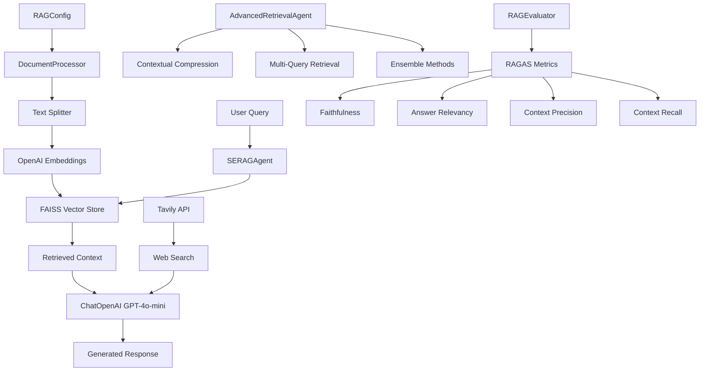

# Simple RAG Components Diagram



## 🎯 **How to View Mermaid Diagrams:**

### **1. VS Code Extension (Recommended)**
- Install "Mermaid Preview" extension in VS Code
- Open this file and right-click → "Open Preview to the Side"

### **2. GitHub (Automatic)**
- Push to GitHub repository
- View the `.md` files online - diagrams render automatically

### **3. Online Editor**
- Go to [mermaid.live](https://mermaid.live/)
- Copy the mermaid code between ```mermaid and ``` tags
- Paste and view instantly

### **4. Command Line (You have this installed)**
```bash
mmdc -i docs/simple_rag_diagram.md -o docs/simple_rag_diagram.png
```
